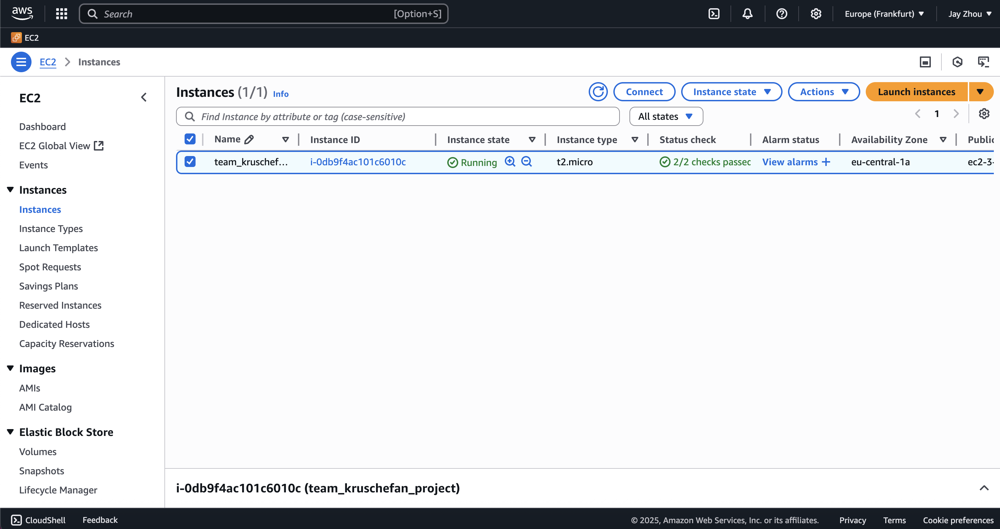
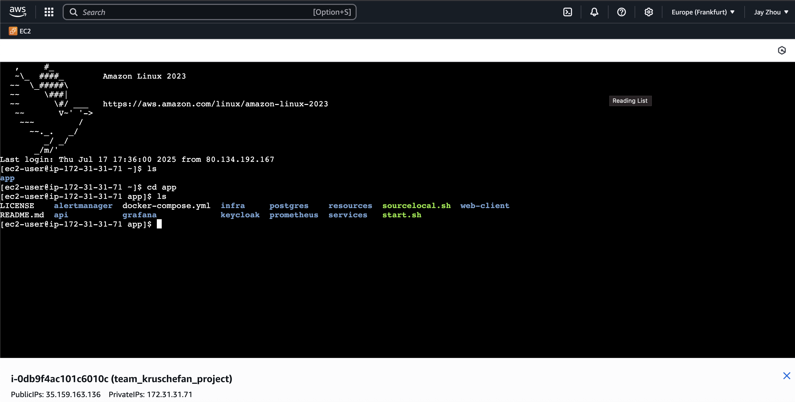

# Infrastructure Setup: Terraform, Ansible, and Kubernetes with Helm

This repository provides a complete infrastructure-as-code setup using Terraform, Ansible, and Kubernetes. It is designed to deploy a containerized microservices system on AWS with observability, service discovery, authentication, and persistence layers.

---

## Terraform: Infrastructure Provisioning

Terraform is used to provision both EC2-based infrastructure, so that the application can be deployed on a cloud virtual machine with the OS of Amazon Linux 2023.

### Structure

- `terraform/`
  - Provisions EC2 instance(s) with security groups and SSH access.
  - Defines outputs (e.g., IP address) and uses variables for AWS region and SSH keys.

### Requirements
- Terraform
- AWS CLI

### Workflow

1. Navigate to `terraform/`.
2. Set AWS credentials as environment variable
   ```bash
   export AWS_ACCESS_KEY_ID=...
   export AWS_SECRET_ACCESS_KEY=...
   export AWS_SESSION_TOKEN=... # Only when required
   ```
3. Source environment variables for SSM storage
   ```bash
   source sourcelocal.sh
   ```
4. Initialize Terraform:
   ```bash
   terraform init
   ```
5. Preview the changes:
   ```bash
   terraform plan 
   ```
6. Apply the configuration:
   ```bash
   terraform apply
   ```

### Output
- public_ip: Public IP address of the EC2 instance
- ssh_connection: SSH connection string
---

## Ansible: Server Configuration and Kubernetes Bootstrap

Ansible automates the provisioning and configuration of the EC2 server. The playbook ensures the node is ready for Helm-based deployments.

### Structure

- `ansible/playbook.yml`: The main entry point.
- `ansible/tasks/`: Task files for installing:
  - Docker
- `ansible/templates/env.j2`: A Jinja2 template for environment variable configuration.
- `ansible/start.sh`: Optional bootstrap script to launch Ansible from shell.

### Workflow

1. Configure the target host and SSH in `ansible.cfg`.
2. Run the playbook:
   ```bash
   ansible-playbook -i <host>, playbook.yml
   ```
   Retrieve the host from the output of the terraform execution.

This installs all necessary tools and prepares the instance for deploying Kubernetes resources using Helm.

---

## Cloud Deployment Proof
Due to AWS resource cost and privacy of the propriertary AWS account, a deployment of the infrastructure on the AWS platform cannot be performed. However, a thorough run of the deployment process has been recorded. Screenshots and logs are provided inside the [logs](./logs). 

After executing Terraform (the logs can be found [here](./logs/terraform_log.txt)), the ec2 instance will be up and can be found in the AWS Console UI.

    


Afterwards, Ansible playbook is executed. (The logs can be found [here](./logs/ansible_log.txt)). As we can see in the screenshot down below, all files are copied into the virtual machine, and is in the state that is ready to be deployed.

    

> IP addresses of the instances in the log in different stages are different, because the pipeline has been logged at different times.
---

## Kubernetes: Microservices Deployment via Helm

Helm is used to manage Kubernetes resources for each microservice and infrastructure component.

### Structure

- `helm/` contains multiple subdirectories, each representing a Helm chart:
  - Applications:
    - `api-gateway`
    - `form-service`
    - `template-service`
    - `user-service`
    - `client` (frontend)
    - `langchain-app`
  - Infrastructure:
    - `mongo`
    - `postgres`
    - `grafana`
    - `prometheus`
    - `alertmanager`
    - `keycloak`

Each chart includes templates for Kubernetes manifests like:

- `deployment.yaml` or `statefulset.yaml`
- `service.yaml`
- `ingress.yaml`
- `hpa.yaml`
- `serviceaccount.yaml`
- `configmaps.yaml`
  - init scripts for keycloak
  - dashboards for grafana
  - rules and targets for prometheus

### Ingress Configuration

Ingress manifests route external HTTP traffic to the internal services. The base ingress file (`helm/ingress.yaml`) defines host-based routing rules, typically used with an NGINX ingress controller in the rancher kubernetes cluster.

Routed paths:
- http://team-kruschefan.local/
  - frontend client
- http://team-kruschefan.local/api
  - api gateway
- http://keycloak.team-kruschefan.local/
  - keycloak
---

## Helmfile Support

`helm/helmfile.yaml` coordinates the deployment of all charts in a defined order. You can deploy the full stack with:

```bash
helmfile apply
```

This ensures consistent deployment and version management of all charts.

---

## Summary

This setup provides:

- **Provisioning** with Terraform for EC2
- **Configuration** with Ansible for server readiness
- **Deployment** with Helm (including metrics, persistence, and authentication)
- **Modularity** with Helm subcharts per service
- **Scalability** with Kubernetes-native constructs like HPA and Ingress

